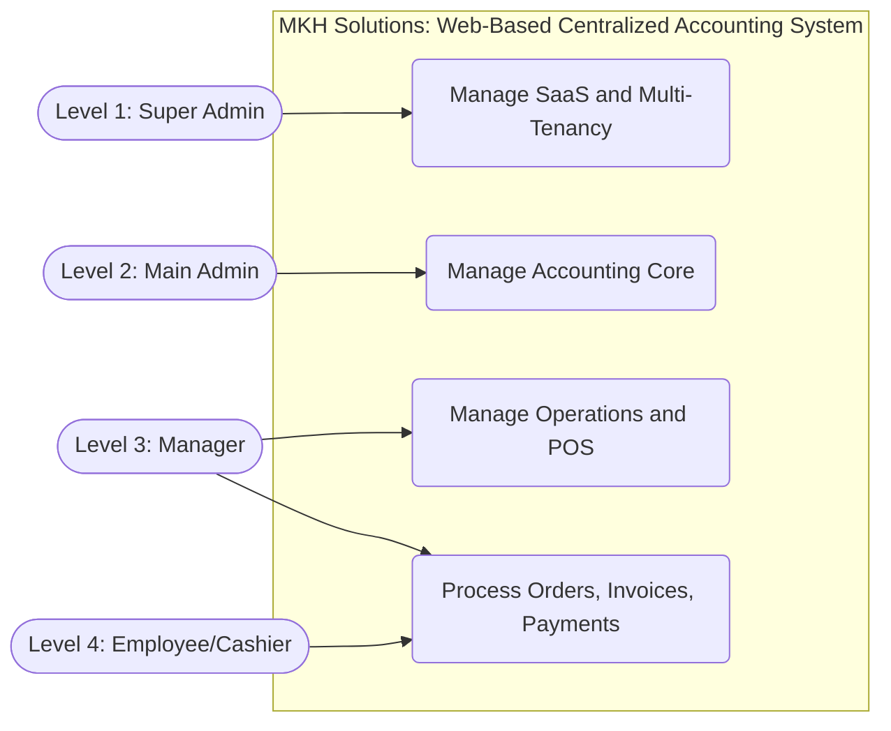
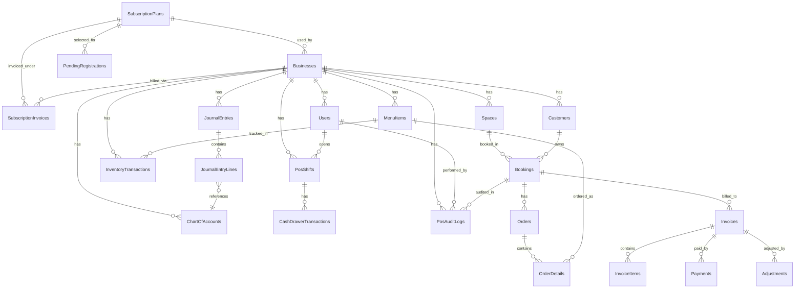

# 1st Deliverables

**AGILE MODEL: REQUIREMENTS AND PLANNING**

## Use Case Diagram (Updated)

## Role-Based Access Control (RBAC)

### 1. Super Admin (System Creator / SaaS Provider)

- Manages the SaaS platform's overall operations and business owner accounts.
- Tracks monthly subscription payments collected from subscribing venues (e.g., ₱500/month per business).
- Views the global revenue dashboard to monitor the SaaS platform's total income and active subscriptions.
- Activates, suspends, or upgrades business owner accounts based on their billing status.

### 2. Main Admin (The Business Owner / Venue Manager)

- Signs up for the SaaS and sets up their specific venue details (e.g., adding 10 Billiard Tables at ₱150/hr).
- Views their specific Revenue Monitoring dashboard to see daily income and profit strictly from their venue.
- Checks the Accounting Integration module to pull their financial reports.

### 3. Staff / Cashier (Front Desk)

- Uses the POS system to start and stop timers for walk-in customers.
- Punches in food and drink orders to add to a customer's running tab.
- Generates the final invoice and processes cash or digital payments.
- Applies credits (like a VIP discount) or debits (like a fee for a broken item).

### 4. Customer (End User)

- Visits the venue's booking portal on their phone.
- Checks which tables or rooms are available right now.
- Books a space, pre-orders food, and pays a downpayment online.

---

## Entity Relational Diagram

## Table Relationships

**SaaS / Platform**

- SubscriptionPlans (1) ➔ (Many) Businesses
- SubscriptionPlans (1) ➔ (Many) PendingRegistrations
- SubscriptionPlans (1) ➔ (Many) SubscriptionInvoices
- Businesses (1) ➔ (Many) SubscriptionInvoices
- Businesses (1) ➔ (Many) Users

**Accounting Core**

- Businesses (1) ➔ (Many) ChartOfAccounts
- Businesses (1) ➔ (Many) JournalEntries
- JournalEntries (1) ➔ (Many) JournalEntryLines
- ChartOfAccounts (1) ➔ (Many) JournalEntryLines

**Operations**

- Businesses (1) ➔ (Many) Customers
- Businesses (1) ➔ (Many) Spaces
- Businesses (1) ➔ (Many) MenuItems
- Businesses (1) ➔ (Many) InventoryTransactions
- MenuItems (1) ➔ (Many) InventoryTransactions

**Shifts and Cash Drawer**

- Businesses (1) ➔ (Many) PosShifts
- Users (1) ➔ (Many) PosShifts
- PosShifts (1) ➔ (Many) CashDrawerTransactions

**POS Audit**

- Businesses (1) ➔ (Many) PosAuditLogs
- Users (1) ➔ (Many) PosAuditLogs
- Bookings (1) ➔ (Many) PosAuditLogs

**Bookings and Orders**

- Spaces (1) ➔ (Many) Bookings
- Customers (1) ➔ (Many) Bookings
- Bookings (1) ➔ (Many) Orders
- Orders (1) ➔ (Many) OrderDetails
- MenuItems (1) ➔ (Many) OrderDetails

**Invoices and Payments**

- Bookings (1) ➔ (Many) Invoices
- Invoices (1) ➔ (Many) InvoiceItems
- Invoices (1) ➔ (Many) Payments
- Invoices (1) ➔ (Many) Adjustments

---

# Data Dictionary

**MKH Solutions: Web-Based Centralized Accounting System**

> **Note:** For the Multi-Tenant setup, indicate the hierarchy level of users for each table.
> Level 1 - Super Admin, Level 2 - Main Admin, Level 3 - Manager, Level 4 - Employee (Cashier and staff).
> Total tables in current system: 22

## Level 1 - Super Admin (Platform and SaaS)

### 1. Users table

| Field Names              | Datatype            | Length | Description             |
| :----------------------- | :------------------ | :----- | :---------------------- |
| UserId-PK                | Int-AI              | 9      | User ID                 |
| BusinessId-FK            | Int (Nullable)      | 9      | Linked business ID      |
| UserRole                 | Text                | 20     | Role or hierarchy level |
| FirstName                | Text                | 50     | User first name         |
| LastName                 | Text                | 50     | User last name          |
| EmailAddress             | Text                | 256    | Login email             |
| PasswordHash             | Text                | N/A    | Hashed password         |
| PasswordResetToken       | Text (Nullable)     | N/A    | Password reset token    |
| PasswordResetTokenExpiry | DateTime (Nullable) | N/A    | Reset token expiration  |
| IsActive                 | Bit                 | 1      | Active status           |

### 2. Businesses table

| Field Names          | Datatype            | Length | Description                   |
| :------------------- | :------------------ | :----- | :---------------------------- |
| BusinessId-PK        | Int-AI              | 9      | Business ID                   |
| PlanId-FK            | Int                 | 9      | Subscription plan ID          |
| BusinessName         | Text                | 100    | Company name                  |
| DomainPrefix         | Text                | 50     | Tenant subdomain prefix       |
| LogoUrl              | Text (Nullable)     | 500    | Logo URL                      |
| TaxRatePercentage    | Decimal             | 5,2    | Default tax rate              |
| SubscriptionStatus   | Text                | 20     | Subscription state            |
| CurrentPeriodEnd     | DateTime (Nullable) | N/A    | Current billing period end    |
| StripeCustomerId     | Text (Nullable)     | 100    | Stripe customer reference     |
| StripeSubscriptionId | Text (Nullable)     | 100    | Stripe subscription reference |
| CreatedAt            | DateTime            | N/A    | Record creation timestamp     |
| IsActive             | Bit                 | 1      | Active status                 |

### 3. SubscriptionPlans table

| Field Names      | Datatype        | Length | Description         |
| :--------------- | :-------------- | :----- | :------------------ |
| PlanId-PK        | Int-AI          | 9      | Plan ID             |
| PlanName         | Text            | 50     | Plan name           |
| MonthlyPrice     | Decimal         | 18,2   | Monthly fee         |
| StripePriceId    | Text (Nullable) | 100    | Stripe price ID     |
| MaxTablesAllowed | Int             | 9      | Allowed table count |
| IsActive         | Bit             | 1      | Active status       |

### 4. SubscriptionInvoices table

| Field Names              | Datatype            | Length | Description                    |
| :----------------------- | :------------------ | :----- | :----------------------------- |
| SubscriptionInvoiceId-PK | Int-AI              | 9      | Subscription invoice ID        |
| BusinessId-FK            | Int                 | 9      | Business billed                |
| PlanId-FK                | Int                 | 9      | Plan billed                    |
| Amount                   | Decimal             | 18,2   | Invoice amount                 |
| Status                   | Text                | 20     | Invoice status                 |
| PaymentMethod            | Text                | 50     | Payment method                 |
| IssuedAt                 | DateTime            | N/A    | Issue date and time            |
| PaidAt                   | DateTime (Nullable) | N/A    | Payment date and time          |
| PeriodStart              | DateTime            | N/A    | Service period start           |
| PeriodEnd                | DateTime            | N/A    | Service period end             |
| ExternalReference        | Text (Nullable)     | 100    | External transaction reference |

### 5. PendingRegistrations table

| Field Names              | Datatype | Length | Description                |
| :----------------------- | :------- | :----- | :------------------------- |
| PendingRegistrationId-PK | Int-AI   | 9      | Pending registration ID    |
| Token                    | Text     | 36     | Verification token         |
| PlanId-FK                | Int      | 9      | Selected plan              |
| BusinessName             | Text     | 100    | Business to register       |
| FirstName                | Text     | 50     | Owner/admin first name     |
| LastName                 | Text     | 50     | Owner/admin last name      |
| EmailAddress             | Text     | 256    | Registration email         |
| PasswordHash             | Text     | N/A    | Hashed password            |
| CreatedAt                | DateTime | N/A    | Created timestamp          |
| ExpiresAt                | DateTime | N/A    | Token expiration timestamp |
| IsUsed                   | Bit      | 1      | Registration consumed flag |

## Level 2 - Main Admin (Finance and Accounting Core)

### 6. ChartOfAccounts table

| Field Names   | Datatype | Length | Description            |
| :------------ | :------- | :----- | :--------------------- |
| AccountId-PK  | Int-AI   | 9      | Account ID             |
| BusinessId-FK | Int      | 9      | Business ID            |
| AccountName   | Text     | 100    | Account title          |
| AccountType   | Text     | 50     | Account classification |
| IsActive      | Bit      | 1      | Active flag            |

### 7. JournalEntries table

| Field Names       | Datatype        | Length | Description        |
| :---------------- | :-------------- | :----- | :----------------- |
| JournalEntryId-PK | Int-AI          | 9      | Journal header ID  |
| BusinessId-FK     | Int             | 9      | Business ID        |
| ReferenceId       | Int (Nullable)  | 9      | Related record ID  |
| ReferenceType     | Text (Nullable) | 50     | Source record type |
| EntryDate         | DateTime        | N/A    | Journal entry date |
| Description       | Text (Nullable) | 255    | Entry memo         |

### 8. JournalEntryLines table

| Field Names       | Datatype | Length | Description          |
| :---------------- | :------- | :----- | :------------------- |
| JournalLineId-PK  | Int-AI   | 9      | Journal line ID      |
| JournalEntryId-FK | Int      | 9      | Parent journal entry |
| AccountId-FK      | Int      | 9      | Linked chart account |
| Debit             | Decimal  | 18,2   | Debit amount         |
| Credit            | Decimal  | 18,2   | Credit amount        |

### 9. Adjustments table

| Field Names     | Datatype        | Length | Description                |
| :-------------- | :-------------- | :----- | :------------------------- |
| AdjustmentId-PK | Int-AI          | 9      | Adjustment ID              |
| InvoiceId-FK    | Int             | 9      | Related invoice            |
| AdjustmentType  | Text            | 10     | Discount or surcharge type |
| Amount          | Decimal         | 18,2   | Adjustment amount          |
| Reason          | Text (Nullable) | 255    | Reason or note             |

## Level 3 - Manager (Operations and Control)

### 10. Customers table

| Field Names   | Datatype        | Length | Description              |
| :------------ | :-------------- | :----- | :----------------------- |
| CustomerId-PK | Int-AI          | 9      | Customer ID              |
| BusinessId-FK | Int             | 9      | Business ID              |
| Name          | Text            | 100    | Customer full name       |
| Email         | Text (Nullable) | 256    | Customer email           |
| Phone         | Text (Nullable) | 20     | Customer phone           |
| CreatedAt     | DateTime        | N/A    | Record created timestamp |

### 11. Spaces table

| Field Names       | Datatype | Length | Description             |
| :---------------- | :------- | :----- | :---------------------- |
| SpaceId-PK        | Int-AI   | 9      | Space or table ID       |
| BusinessId-FK     | Int      | 9      | Business ID             |
| SpaceName         | Text     | 50     | Name or number of space |
| FloorArea         | Text     | 50     | Floor/zone              |
| Capacity          | Int      | 9      | Seating capacity        |
| CurrentHourlyRate | Decimal  | 18,2   | Current hourly rate     |
| CurrentStatus     | Text     | 20     | Availability status     |
| IsActive          | Bit      | 1      | Active flag             |

### 12. MenuItems table

| Field Names       | Datatype | Length | Description       |
| :---------------- | :------- | :----- | :---------------- |
| ItemId-PK         | Int-AI   | 9      | Menu item ID      |
| BusinessId-FK     | Int      | 9      | Business ID       |
| ItemName          | Text     | 100    | Item name         |
| CurrentPrice      | Decimal  | 18,2   | Selling price     |
| CostPrice         | Decimal  | 18,2   | Cost price        |
| StockAvailable    | Int      | 9      | Current stock     |
| LowStockThreshold | Int      | 9      | Low-stock trigger |
| IsActive          | Bit      | 1      | Active flag       |

### 13. InventoryTransactions table

| Field Names               | Datatype        | Length | Description              |
| :------------------------ | :-------------- | :----- | :----------------------- |
| InventoryTransactionId-PK | Int-AI          | 9      | Inventory transaction ID |
| BusinessId-FK             | Int             | 9      | Business ID              |
| ItemId-FK                 | Int             | 9      | Menu item ID             |
| QuantityChange            | Int             | 9      | Change in stock          |
| PreviousStock             | Int             | 9      | Stock before change      |
| NewStock                  | Int             | 9      | Stock after change       |
| TransactionType           | Text            | 20     | IN, OUT, ADJUST          |
| Notes                     | Text (Nullable) | 255    | Remarks                  |
| CreatedAt                 | DateTime        | N/A    | Transaction timestamp    |

### 14. CashDrawerTransactions table

| Field Names            | Datatype        | Length | Description           |
| :--------------------- | :-------------- | :----- | :-------------------- |
| DrawerTransactionId-PK | Int-AI          | 9      | Drawer transaction ID |
| BusinessId-FK          | Int             | 9      | Business ID           |
| ShiftId-FK             | Int             | 9      | POS shift ID          |
| TransactionType        | Text            | 20     | IN or OUT movement    |
| Amount                 | Decimal         | 18,2   | Moved cash amount     |
| Notes                  | Text (Nullable) | 255    | Remarks               |
| CreatedAt              | DateTime        | N/A    | Transaction timestamp |

### 15. PosAuditLogs table

| Field Names      | Datatype        | Length | Description         |
| :--------------- | :-------------- | :----- | :------------------ |
| PosAuditLogId-PK | Int-AI          | 9      | POS audit log ID    |
| BusinessId-FK    | Int             | 9      | Business ID         |
| CashierId-FK     | Int             | 9      | Cashier user ID     |
| BookingId-FK     | Int (Nullable)  | 9      | Related booking     |
| ActionType       | Text            | 40     | Action type         |
| SourceSpaceId    | Int (Nullable)  | 9      | Original space ID   |
| SourceSpaceName  | Text (Nullable) | 50     | Original space name |
| TargetSpaceId    | Int (Nullable)  | 9      | Target space ID     |
| TargetSpaceName  | Text (Nullable) | 50     | Target space name   |
| SplitCount       | Int (Nullable)  | 9      | Number of splits    |
| InvoiceIds       | Text (Nullable) | 255    | Related invoice IDs |
| Details          | Text (Nullable) | 500    | Action details      |
| CreatedAt        | DateTime        | N/A    | Audit timestamp     |

## Level 4 - Employee (Cashier and Staff)

### 16. PosShifts table

| Field Names   | Datatype            | Length | Description            |
| :------------ | :------------------ | :----- | :--------------------- |
| ShiftId-PK    | Int-AI              | 9      | Shift ID               |
| BusinessId-FK | Int                 | 9      | Business ID            |
| CashierId-FK  | Int                 | 9      | Assigned cashier       |
| OpenedAt      | DateTime            | N/A    | Shift opened timestamp |
| ClosedAt      | DateTime (Nullable) | N/A    | Shift closed timestamp |
| OpeningCash   | Decimal             | 18,2   | Opening cash amount    |
| ExpectedCash  | Decimal             | 18,2   | Expected closing cash  |
| ActualCash    | Decimal (Nullable)  | 18,2   | Actual closing cash    |
| Variance      | Decimal (Nullable)  | 18,2   | Difference amount      |
| Status        | Text                | 20     | Open or Closed         |
| Notes         | Text (Nullable)     | 255    | Shift notes            |

### 17. Bookings table

| Field Names       | Datatype            | Length | Description            |
| :---------------- | :------------------ | :----- | :--------------------- |
| BookingId-PK      | Int-AI              | 9      | Booking ID             |
| BusinessId-FK     | Int                 | 9      | Business ID            |
| SpaceId-FK        | Int                 | 9      | Space ID               |
| CustomerId-FK     | Int (Nullable)      | 9      | Customer ID            |
| StartTime         | DateTime            | N/A    | Booking start          |
| EndTime           | DateTime (Nullable) | N/A    | Booking end            |
| DurationHours     | Decimal (Nullable)  | 10,2   | Duration in hours      |
| LockedHourlyRate  | Decimal             | 18,2   | Applied hourly rate    |
| BookingStatus     | Text                | 20     | Status                 |
| ReferenceCode     | Text (Nullable)     | 20     | Booking reference code |
| CheckoutRequested | Bit                 | 1      | Customer checkout flag |

### 18. Orders table

| Field Names   | Datatype | Length | Description     |
| :------------ | :------- | :----- | :-------------- |
| OrderId-PK    | Int-AI   | 9      | Order ID        |
| BusinessId-FK | Int      | 9      | Business ID     |
| BookingId-FK  | Int      | 9      | Booking ID      |
| CashierId-FK  | Int      | 9      | Cashier user ID |
| OrderTime     | DateTime | N/A    | Order timestamp |

### 19. OrderDetails table

| Field Names      | Datatype | Length | Description              |
| :--------------- | :------- | :----- | :----------------------- |
| OrderDetailId-PK | Int-AI   | 9      | Order line ID            |
| OrderId-FK       | Int      | 9      | Order ID                 |
| ItemId-FK        | Int      | 9      | Menu item ID             |
| Quantity         | Int      | 9      | Ordered quantity         |
| LockedUnitPrice  | Decimal  | 18,2   | Unit price at order time |

### 20. Invoices table

| Field Names    | Datatype | Length | Description                  |
| :------------- | :------- | :----- | :--------------------------- |
| InvoiceId-PK   | Int-AI   | 9      | Invoice ID                   |
| BusinessId-FK  | Int      | 9      | Business ID                  |
| BookingId-FK   | Int      | 9      | Booking ID                   |
| SubTotal       | Decimal  | 18,2   | Amount before adjustments    |
| DiscountAmount | Decimal  | 18,2   | Discount value               |
| TaxAmount      | Decimal  | 18,2   | Tax value                    |
| TotalAmount    | Decimal  | 18,2   | Final total                  |
| TaxRateApplied | Decimal  | 5,4    | Applied tax rate             |
| PaymentStatus  | Text     | 20     | Payment status               |
| GeneratedDate  | DateTime | N/A    | Invoice generation timestamp |

### 21. InvoiceItems table

| Field Names      | Datatype | Length | Description       |
| :--------------- | :------- | :----- | :---------------- |
| InvoiceItemId-PK | Int-AI   | 9      | Invoice item ID   |
| InvoiceId-FK     | Int      | 9      | Parent invoice ID |
| ItemType         | Text     | 20     | Item category     |
| Description      | Text     | 100    | Item description  |
| Quantity         | Int      | 9      | Quantity          |
| UnitPrice        | Decimal  | 18,2   | Unit price        |
| Total            | Decimal  | 18,2   | Line total        |

### 22. Payments table

| Field Names     | Datatype        | Length | Description        |
| :-------------- | :-------------- | :----- | :----------------- |
| PaymentId-PK    | Int-AI          | 9      | Payment ID         |
| BusinessId-FK   | Int             | 9      | Business ID        |
| InvoiceId-FK    | Int             | 9      | Invoice ID         |
| AmountPaid      | Decimal         | 18,2   | Amount paid        |
| PaymentMethod   | Text            | 50     | Method used        |
| PaymentDate     | DateTime        | N/A    | Payment timestamp  |
| ReferenceNumber | Text (Nullable) | 100    | External reference |
