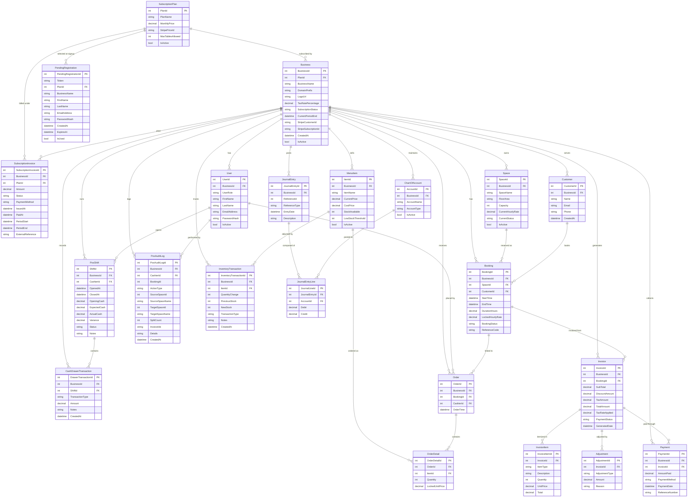
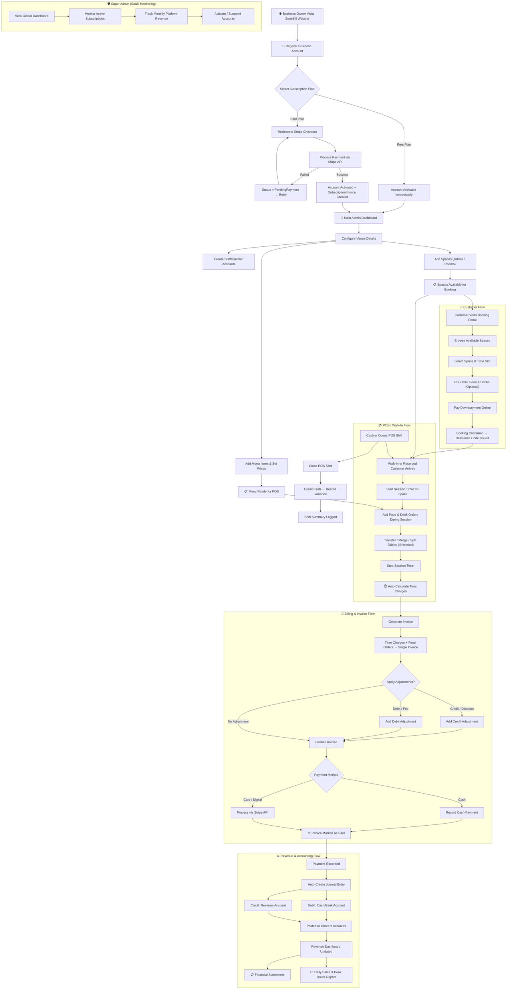

# ZoneBill: A Cloud-Based Reservation and Accounting Hub for Entertainment Businesses

**Name:** JOHN NIKOLAI O. LLOREN
**Subject:** IT15/L Integrative Programming and Technologies
**Code:** 8466 | **Time:** 130–330
**Topic:** #12. Billing, Invoicing & Revenue Management System
**Products/Services:** Entertainment Venues (Billiard Lounges, KTV Bars, Bowling Alleys)

---

## 1st Deliverables — AGILE MODEL: REQUIREMENTS AND PLANNING

---

## 1. Use Case Diagram (Updated)

> Role-Based Access across 4 actor types interacting with 5 major system modules.

```mermaid
graph LR
    subgraph Actors
        SA["🛡️ Super Admin<br/>(SaaS Provider)"]
        MA["🏢 Main Admin<br/>(Business Owner)"]
        SC["💳 Staff / Cashier<br/>(Front Desk)"]
        CU["👤 Customer<br/>(End User)"]
    end

    subgraph UC_Platform["Platform Administration"]
        UC1["Manage SaaS Platform"]
        UC2["Track Subscription Payments"]
        UC3["View Global Revenue Dashboard"]
        UC4["Activate / Suspend / Upgrade Accounts"]
        UC5["Manage Subscription Plans"]
    end

    subgraph UC_Venue["Venue & Space Management"]
        UC6["Register Business / Sign Up"]
        UC7["Configure Venue Details"]
        UC8["Manage Spaces (Tables/Rooms)"]
        UC9["View Venue Revenue Dashboard"]
        UC10["Manage Staff Accounts"]
        UC11["Manage Menu Items & Inventory"]
    end

    subgraph UC_POS["POS & Food Ordering"]
        UC12["Start / Stop Session Timer"]
        UC13["Punch In Food & Drink Orders"]
        UC14["Transfer / Merge / Split Tables"]
        UC15["Open / Close POS Shift"]
        UC16["Manage Cash Drawer"]
    end

    subgraph UC_Billing["Billing & Invoicing"]
        UC17["Generate Invoice"]
        UC18["Apply Credit / Debit Adjustments"]
        UC19["Process Cash Payment"]
        UC20["Process Digital / Card Payment"]
        UC21["View Invoice History"]
    end

    subgraph UC_Accounting["Revenue & Accounting"]
        UC22["View Financial Reports"]
        UC23["View Chart of Accounts"]
        UC24["View Journal Entries"]
        UC25["Monitor Revenue & Peak Hours"]
    end

    subgraph UC_Customer["Customer Portal"]
        UC26["Browse Available Spaces"]
        UC27["Book a Space Online"]
        UC28["Pre-Order Food & Drinks"]
        UC29["Pay Downpayment Online"]
        UC30["View Booking Status"]
    end

    SA --> UC1
    SA --> UC2
    SA --> UC3
    SA --> UC4
    SA --> UC5

    MA --> UC6
    MA --> UC7
    MA --> UC8
    MA --> UC9
    MA --> UC10
    MA --> UC11
    MA --> UC22
    MA --> UC23
    MA --> UC24
    MA --> UC25

    SC --> UC12
    SC --> UC13
    SC --> UC14
    SC --> UC15
    SC --> UC16
    SC --> UC17
    SC --> UC18
    SC --> UC19
    SC --> UC20
    SC --> UC21

    CU --> UC26
    CU --> UC27
    CU --> UC28
    CU --> UC29
    CU --> UC30
```

---

## 2. Entity Relational Diagram (ERD)

> All 21 entities derived from the actual `Entities.cs` codebase, with full relationship cardinalities.

---

## 3. Full System Flow

> End-to-end business process from SaaS registration → venue operations → accounting.

---

## 4. Data Dictionary

> **Multi-Tenant Hierarchy:**
> - **Level 1 – Super Admin** (SaaS Provider): Manages platform-wide tables
> - **Level 2 – Main Admin** (Business Owner): Manages venue-specific configuration tables
> - **Level 3 – Staff / Cashier** (Front Desk): Operates transactional tables
> - **Level 4 – Customer** (End User): Interacts with booking/portal tables

---

### Level 1 — Super Admin (SaaS Platform Tables)

#### SubscriptionPlans Table

| Field Name | Datatype | Length | Description |
|---|---|---|---|
| PlanId – PK | Int-AI | 9 | Subscription Plan's unique ID |
| PlanName | Text | 50 | Name of the subscription plan (e.g., Free, Pro, Enterprise) |
| MonthlyPrice | Decimal(18,2) | 18 | Monthly price charged to subscribing businesses |
| StripePriceId | Text | 100 | Stripe API Price ID for recurring billing |
| MaxTablesAllowed | Int | 9 | Maximum number of spaces/tables allowed under this plan |
| IsActive | Bit | 1 | Whether the plan is currently available for selection |

#### Businesses Table

| Field Name | Datatype | Length | Description |
|---|---|---|---|
| BusinessId – PK | Int-AI | 9 | Business's unique ID number |
| PlanId – FK | Int | 9 | References the SubscriptionPlan the business is subscribed to |
| BusinessName | Text | 100 | Registered name of the entertainment venue |
| DomainPrefix | Text | 50 | Unique subdomain prefix for the business (e.g., "joes-billiards") |
| LogoUrl | Text | 500 | URL path to the business's uploaded logo |
| TaxRatePercentage | Decimal(5,2) | 5 | Tax rate applied to invoices (e.g., 12.00 for 12% VAT) |
| SubscriptionStatus | Text | 20 | Current status: Active, PendingPayment, Suspended, Cancelled |
| CurrentPeriodEnd | DateTime | – | End date of the current billing period |
| StripeCustomerId | Text | 100 | Stripe Customer ID for payment processing |
| StripeSubscriptionId | Text | 100 | Stripe Subscription ID for recurring billing |
| CreatedAt | DateTime | – | Timestamp when the business account was created |
| IsActive | Bit | 1 | Whether the business account is active |

#### SubscriptionInvoices Table

| Field Name | Datatype | Length | Description |
|---|---|---|---|
| SubscriptionInvoiceId – PK | Int-AI | 9 | SaaS subscription invoice's unique ID |
| BusinessId – FK | Int | 9 | References the Business that was billed |
| PlanId – FK | Int | 9 | References the SubscriptionPlan billed for |
| Amount | Decimal(18,2) | 18 | Total amount charged for this billing cycle |
| Status | Text | 20 | Payment status: Paid, Pending, Failed |
| PaymentMethod | Text | 50 | Method of payment: Stripe, MockGateway, etc. |
| IssuedAt | DateTime | – | Timestamp when the invoice was issued |
| PaidAt | DateTime | – | Timestamp when payment was received (nullable) |
| PeriodStart | DateTime | – | Start date of the billing period covered |
| PeriodEnd | DateTime | – | End date of the billing period covered |
| ExternalReference | Text | 100 | Stripe Invoice ID or external payment reference |

#### PendingRegistrations Table

| Field Name | Datatype | Length | Description |
|---|---|---|---|
| PendingRegistrationId – PK | Int-AI | 9 | Pending registration's unique ID |
| Token | Text | 36 | Unique GUID token for Stripe checkout session |
| PlanId – FK | Int | 9 | References the SubscriptionPlan selected during signup |
| BusinessName | Text | 100 | Name of the business being registered |
| FirstName | Text | 50 | Owner's first name |
| LastName | Text | 50 | Owner's last name |
| EmailAddress | Text | 256 | Owner's email address for account creation |
| PasswordHash | Text | – | Hashed password stored during registration flow |
| CreatedAt | DateTime | – | Timestamp when the pending registration was created |
| ExpiresAt | DateTime | – | Expiration time after which the registration token is invalid |
| IsUsed | Bit | 1 | Whether this registration has been completed |

---

### Level 2 — Main Admin (Venue Configuration Tables)

#### Users Table

| Field Name | Datatype | Length | Description |
|---|---|---|---|
| UserId – PK | Int-AI | 9 | User's unique ID number |
| BusinessId – FK | Int | 9 | References the Business the user belongs to (null for Super Admin) |
| UserRole | Text | 20 | Role: SuperAdmin, MainAdmin, Staff, Cashier |
| FirstName | Text | 50 | User's first name |
| LastName | Text | 50 | User's last name |
| EmailAddress | Text | 256 | User's email address (unique, used for login) |
| PasswordHash | Text | – | Hashed password for authentication |
| IsActive | Bit | 1 | Whether the user account is active |

#### Spaces Table

| Field Name | Datatype | Length | Description |
|---|---|---|---|
| SpaceId – PK | Int-AI | 9 | Space's unique ID number |
| BusinessId – FK | Int | 9 | References the Business that owns this space |
| SpaceName | Text | 50 | Display name of the space (e.g., "Table 1", "KTV Room A") |
| FloorArea | Text | 50 | Floor or area grouping (e.g., "Main Floor", "2nd Floor VIP") |
| Capacity | Int | 9 | Maximum number of persons allowed (default: 4) |
| CurrentHourlyRate | Decimal(18,2) | 18 | Current hourly rate charged for using this space |
| CurrentStatus | Text | 20 | Status: Available, InUse, Reserved, Maintenance |
| IsActive | Bit | 1 | Whether the space is active and bookable |

#### MenuItems Table

| Field Name | Datatype | Length | Description |
|---|---|---|---|
| ItemId – PK | Int-AI | 9 | Menu item's unique ID number |
| BusinessId – FK | Int | 9 | References the Business that sells this item |
| ItemName | Text | 100 | Name of the food or drink item (e.g., "San Miguel Pale Pilsen") |
| CurrentPrice | Decimal(18,2) | 18 | Current selling price of the item |
| CostPrice | Decimal(18,2) | 18 | Cost/purchase price for profit calculation (default: 0) |
| StockAvailable | Int | 9 | Current quantity in stock |
| LowStockThreshold | Int | 9 | Quantity threshold that triggers a low-stock alert (default: 5) |
| IsActive | Bit | 1 | Whether the item is currently available for ordering |

#### InventoryTransactions Table

| Field Name | Datatype | Length | Description |
|---|---|---|---|
| InventoryTransactionId – PK | Int-AI | 9 | Inventory transaction's unique ID |
| BusinessId – FK | Int | 9 | References the Business that owns the inventory |
| ItemId – FK | Int | 9 | References the MenuItem being adjusted |
| QuantityChange | Int | 9 | Number of units added (+) or removed (−) |
| PreviousStock | Int | 9 | Stock level before the transaction |
| NewStock | Int | 9 | Stock level after the transaction |
| TransactionType | Text | 20 | Type: Restock, Sale, Adjustment, Spoilage |
| Notes | Text | 255 | Optional notes explaining the transaction |
| CreatedAt | DateTime | – | Timestamp when the transaction was recorded |

#### ChartOfAccounts Table

| Field Name | Datatype | Length | Description |
|---|---|---|---|
| AccountId – PK | Int-AI | 9 | Chart of Account's unique ID |
| BusinessId – FK | Int | 9 | References the Business that maintains this account |
| AccountName | Text | 100 | Name of the account (e.g., "Cash on Hand", "Sales Revenue") |
| AccountType | Text | 50 | Type: Asset, Liability, Equity, Revenue, Expense |
| IsActive | Bit | 1 | Whether the account is currently active |

---

### Level 3 — Staff / Cashier (Transactional Tables)

#### Customers Table

| Field Name | Datatype | Length | Description |
|---|---|---|---|
| CustomerId – PK | Int-AI | 9 | Customer's unique ID number |
| BusinessId – FK | Int | 9 | References the Business the customer is registered under |
| Name | Text | 100 | Customer's full name |
| Email | Text | 256 | Customer's email address (optional) |
| Phone | Text | 20 | Customer's phone number (optional) |
| CreatedAt | DateTime | – | Timestamp when the customer was registered |

#### Bookings Table

| Field Name | Datatype | Length | Description |
|---|---|---|---|
| BookingId – PK | Int-AI | 9 | Booking's unique ID number |
| BusinessId – FK | Int | 9 | References the Business where the booking is made |
| SpaceId – FK | Int | 9 | References the Space (table/room) being booked |
| CustomerId – FK | Int | 9 | References the Customer who made the booking (nullable for walk-ins) |
| StartTime | DateTime | – | Date and time when the session started |
| EndTime | DateTime | – | Date and time when the session ended (nullable if ongoing) |
| DurationHours | Decimal(10,2) | 10 | Calculated total hours of usage |
| LockedHourlyRate | Decimal(18,2) | 18 | Hourly rate locked at the time of booking |
| BookingStatus | Text | 20 | Status: Active, Completed, Cancelled, Reserved |
| ReferenceCode | Text | 20 | Unique reference code for the booking |

#### PosShifts Table

| Field Name | Datatype | Length | Description |
|---|---|---|---|
| ShiftId – PK | Int-AI | 9 | POS Shift's unique ID |
| BusinessId – FK | Int | 9 | References the Business running this shift |
| CashierId – FK | Int | 9 | References the User (cashier) who opened this shift |
| OpenedAt | DateTime | – | Timestamp when the shift was opened |
| ClosedAt | DateTime | – | Timestamp when the shift was closed (nullable if still open) |
| OpeningCash | Decimal(18,2) | 18 | Amount of cash in the drawer at shift start |
| ExpectedCash | Decimal(18,2) | 18 | System-calculated expected cash at shift end |
| ActualCash | Decimal(18,2) | 18 | Actual counted cash at shift end (nullable) |
| Variance | Decimal(18,2) | 18 | Difference between actual and expected cash (nullable) |
| Status | Text | 20 | Shift status: Open, Closed |
| Notes | Text | 255 | Optional notes from the cashier |

#### CashDrawerTransactions Table

| Field Name | Datatype | Length | Description |
|---|---|---|---|
| DrawerTransactionId – PK | Int-AI | 9 | Cash drawer transaction's unique ID |
| BusinessId – FK | Int | 9 | References the Business |
| ShiftId – FK | Int | 9 | References the PosShift this transaction belongs to |
| TransactionType | Text | 20 | Type: CashIn, CashOut, PayIn, PayOut |
| Amount | Decimal(18,2) | 18 | Amount of the cash transaction |
| Notes | Text | 255 | Optional notes explaining the transaction |
| CreatedAt | DateTime | – | Timestamp when the transaction was recorded |

#### PosAuditLogs Table

| Field Name | Datatype | Length | Description |
|---|---|---|---|
| PosAuditLogId – PK | Int-AI | 9 | POS Audit Log's unique ID |
| BusinessId – FK | Int | 9 | References the Business |
| CashierId – FK | Int | 9 | References the User (cashier) who performed the action |
| BookingId | Int | 9 | References the related Booking (nullable) |
| ActionType | Text | 40 | Type of POS action: Transfer, Merge, Split, VoidOrder, etc. |
| SourceSpaceId | Int | 9 | ID of the source space (for transfers/merges) |
| SourceSpaceName | Text | 50 | Name of the source space |
| TargetSpaceId | Int | 9 | ID of the target space (for transfers) |
| TargetSpaceName | Text | 50 | Name of the target space |
| SplitCount | Int | 9 | Number of split invoices generated |
| InvoiceIds | Text | 255 | Comma-separated Invoice IDs involved |
| Details | Text | 500 | Descriptive details of the action performed |
| CreatedAt | DateTime | – | Timestamp when the audit event was logged |

#### Orders Table

| Field Name | Datatype | Length | Description |
|---|---|---|---|
| OrderId – PK | Int-AI | 9 | Order's unique ID number |
| BusinessId – FK | Int | 9 | References the Business that received the order |
| BookingId – FK | Int | 9 | References the Booking (session) the order is linked to |
| CashierId – FK | Int | 9 | References the User (cashier) who placed the order |
| OrderTime | DateTime | – | Timestamp when the order was placed |

#### OrderDetails Table

| Field Name | Datatype | Length | Description |
|---|---|---|---|
| OrderDetailId – PK | Int-AI | 9 | Order detail line's unique ID |
| OrderId – FK | Int | 9 | References the parent Order |
| ItemId – FK | Int | 9 | References the MenuItem ordered |
| Quantity | Int | 9 | Number of units ordered |
| LockedUnitPrice | Decimal(18,2) | 18 | Unit price locked at the time of ordering |

#### Invoices Table

| Field Name | Datatype | Length | Description |
|---|---|---|---|
| InvoiceId – PK | Int-AI | 9 | Invoice's unique ID number |
| BusinessId – FK | Int | 9 | References the Business that generated the invoice |
| BookingId – FK | Int | 9 | References the Booking (session) being invoiced |
| SubTotal | Decimal(18,2) | 18 | Total before discounts and tax |
| DiscountAmount | Decimal(18,2) | 18 | Total discount amount applied |
| TaxAmount | Decimal(18,2) | 18 | Computed tax amount |
| TotalAmount | Decimal(18,2) | 18 | Final amount due (SubTotal − Discount + Tax) |
| TaxRateApplied | Decimal(5,4) | 5 | Tax rate used at invoice generation (e.g., 0.1200 for 12%) |
| PaymentStatus | Text | 20 | Status: Unpaid, PartiallyPaid, Paid, Voided |
| GeneratedDate | DateTime | – | Timestamp when the invoice was generated |

#### InvoiceItems Table

| Field Name | Datatype | Length | Description |
|---|---|---|---|
| InvoiceItemId – PK | Int-AI | 9 | Invoice item line's unique ID |
| InvoiceId – FK | Int | 9 | References the parent Invoice |
| ItemType | Text | 20 | Type: TimeCharge, FoodOrder, Service |
| Description | Text | 100 | Description of the line item (e.g., "Table 1 – 2.5 hrs") |
| Quantity | Int | 9 | Number of units |
| UnitPrice | Decimal(18,2) | 18 | Price per unit |
| Total | Decimal(18,2) | 18 | Line total (Quantity × UnitPrice) |

#### Adjustments Table

| Field Name | Datatype | Length | Description |
|---|---|---|---|
| AdjustmentId – PK | Int-AI | 9 | Adjustment's unique ID |
| InvoiceId – FK | Int | 9 | References the Invoice being adjusted |
| AdjustmentType | Text | 10 | Type: Credit (discount/VIP) or Debit (fee/damage) |
| Amount | Decimal(18,2) | 18 | Amount of the adjustment |
| Reason | Text | 255 | Explanation for the adjustment (e.g., "VIP Discount", "Broken Cue Stick") |

#### Payments Table

| Field Name | Datatype | Length | Description |
|---|---|---|---|
| PaymentId – PK | Int-AI | 9 | Payment's unique ID number |
| BusinessId – FK | Int | 9 | References the Business that collected the payment |
| InvoiceId – FK | Int | 9 | References the Invoice being paid |
| AmountPaid | Decimal(18,2) | 18 | Amount paid in this transaction |
| PaymentMethod | Text | 50 | Method: Cash, Card, GCash, Stripe, BankTransfer |
| PaymentDate | DateTime | – | Timestamp when the payment was made |
| ReferenceNumber | Text | 100 | External payment reference or receipt number |

---

### Level 2 — Main Admin (Accounting / Financial Tables)

#### JournalEntries Table

| Field Name | Datatype | Length | Description |
|---|---|---|---|
| JournalEntryId – PK | Int-AI | 9 | Journal entry's unique ID |
| BusinessId – FK | Int | 9 | References the Business posting this entry |
| ReferenceId | Int | 9 | ID of the source document (e.g., InvoiceId, PaymentId) (nullable) |
| ReferenceType | Text | 50 | Type of source: Payment, Adjustment, Manual (nullable) |
| EntryDate | DateTime | – | Date the journal entry was recorded |
| Description | Text | 255 | Description of the journal entry |

#### JournalEntryLines Table

| Field Name | Datatype | Length | Description |
|---|---|---|---|
| JournalLineId – PK | Int-AI | 9 | Journal line's unique ID |
| JournalEntryId – FK | Int | 9 | References the parent JournalEntry |
| AccountId – FK | Int | 9 | References the ChartOfAccount being debited or credited |
| Debit | Decimal(18,2) | 18 | Debit amount (default: 0) |
| Credit | Decimal(18,2) | 18 | Credit amount (default: 0) |

---

### Summary of Table Hierarchy by Role Access

| Level | Role | Tables Managed / Accessed |
|---|---|---|
| **Level 1** | **Super Admin** | SubscriptionPlans, Businesses, SubscriptionInvoices, PendingRegistrations, Users (all) |
| **Level 2** | **Main Admin** | Users (own venue), Spaces, MenuItems, InventoryTransactions, ChartOfAccounts, JournalEntries, JournalEntryLines |
| **Level 3** | **Staff / Cashier** | Customers, Bookings, PosShifts, CashDrawerTransactions, PosAuditLogs, Orders, OrderDetails, Invoices, InvoiceItems, Adjustments, Payments |
| **Level 4** | **Customer** | Bookings (own), Spaces (read-only availability), MenuItems (read-only for pre-ordering) |
